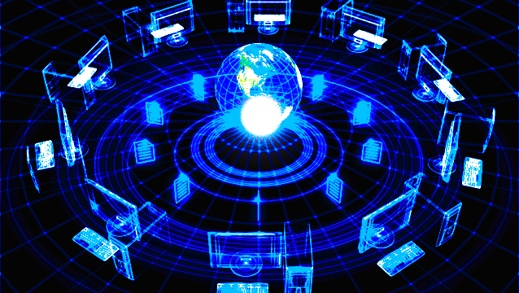

# Net_Practice

This project is a general practical exercise to let you discover networking.

* **what is a Computer Network:**
    is a connection between tow or more devices.

* **What is a Router:**
    + a Router is a hardware component that takes care of routing packets.
    + It determines which node the packet came from and which destination node the sender node want to send it to.
    + Routers have a specific “Routing Protocol” which defines how routers communicate with each other.
    + Routers build up a “Routing Table” which identifies the most optimized paths to be taken in the network while sending packets.
    

* **What is a Routing Table:**
    + Is a table with the list of **routes** from one router to other.
    + Each route consists of the address of the other routers/nodes in the network and how to reach them.
    + A "Routing Table" has : Destination IP Address, Gateway, Genmask/Subnet mask, Flags, Iface (Network interface).
    + The main purpose of a routing table is to help routers make effective routing decisions.
    + Whenever a packet is sent through a router to be forwarded to a host on another network, the router consults the routing table
        to find the IP address of the **destination device** and the best path to reach it. 

* **What is a Gateway:**
    + A Gateway is the component which connects two networks.
    + Usually, the gateways are nothing but the routers.

* **What is Genmask/Subnet mask:**
    + A subnet mask is a number which when combined with an IP address allows you to divide
        the IP space into smaller and smaller chunks for use in both physical and logical networks.

* **NAT (Network Address Translation):**
    + It is a fundamental networking technique used to allow multiple devices within a local network
    to share a single public IP address when connecting to the internet. 
    + It serves several purposes in networking: 
        + Address Conservation: allowing multiple devices on a network to share a single public IP helps conserve the limited pool of available IPv4 addresses.
        + Security: NAT acts as a basic firewall by hiding the internal IP addresses of devices on the local network. 

* **Dynamic Host Configuration Protocol (DHCP):**
    Is responsible for assigning dynamic IP addresses to the hosts.

* **Domain Name System/Server (DNS):**
    Is a server having huge records of domain name mapping IP addresses which searches for the domain
        input and returns the respective IP address of the machine on which the website you want to access is hosted.

* **Internet Service Providers (ISPs):**
    + Are the companies that provide everyone Internet.
    + ISPs provide internet, handle routing your requests to the correct destination, resolve domain names with the help of DNS cache that they maintain,
        and handle all this network infrastructure which enables us to use the internet.

* **OSI (Open Systems Interconnection) Module:**

    

    OSI Module used to understand how data is transford from one computer to anouthe in a computer network.
    + Application Layer (Layer 7):
        - The Application Layer is the topmost layer and is responsible for user-level applications and services.
        - It includes a wide range of protocols for various purposes, such as HTTP (for web browsing), FTP (for file transfer), SMTP (for email), and many others.
        - Application-layer protocols define how data should be formatted, transmitted, and interpreted by applications.

    + Presentation Layer (Layer 6):
        - The Presentation Layer deals with data translation, encryption, and compression.
        - It ensures that data from the application layer is properly formatted, encrypted, and decrypted as needed.
        - Data compression and data format conversions are performed here.

    + Session Layer (Layer 5):
        - he Session Layer establishes, manages, and terminates sessions (connections) between two devices.
        - It handles dialog control and synchronization, allowing data exchange between applications.
        - This layer also manages sessions in which multiple data streams can be interleaved.

    + Transport Layer (Layer 4):
        - The Transport Layer ensures end-to-end communication between devices on different networks.
        - It manages data segmentation, error checking, flow control, and end-to-end communication.
        - Key protocols include Transmission Control Protocol (TCP) and User Datagram Protocol (UDP).

    + Network Layer (Layer 3):
        - The Network Layer focuses on end-to-end communication and routing data packets between different networks.
        - It uses logical addressing (IP addresses) to identify devices on different networks.
        - Key functions include routing, logical addressing, and the handling of packets.
        - The Internet Protocol (IP) is a common Layer 3 protocol.

    + Data Link Layer (Layer 2):
        - The Data Link Layer is responsible for reliable point-to-point and point-to-multipoint communication between devices on the same network segment.
        - It addresses issues like framing (dividing data into frames), error detection and correction, MAC (Media Access Control) addressing, and flow control.
        - Ethernet and Wi-Fi are examples of Layer 2 technologies.

    + Physical Layer (Layer 1):
        - The Physical Layer deals with the physical medium and hardware aspects of network communication.
        - It defines specifications for cables, connectors, electrical signals, and physical transmission media.
        - Functions include encoding and decoding of data bits, signal modulation, and transmission of raw binary data over the physical medium.

* **IP/TCP Module:**

       

    The TCP/IP model is a set of protocols used for communication on the internet
    + Application layer:
        - The Application Layer is the topmost layer and is responsible for user-level applications and services.
        - It includes a wide range of protocols for various purposes, such as HTTP (for web browsing), FTP (for file transfer), SMTP (for email), and many others.
        - Application-layer protocols define how data should be formatted, transmitted, and interpreted by applications.
        - This layer combines functions from the OSI Session, Presentation, and Application Layers.

    + Transpot Layer:
        - The Transport Layer ensures end-to-end communication between devices on different networks.
        - It manages data segmentation, error checking, and flow control.
        - Two key protocols at this layer are Transmission Control Protocol (TCP), which offers reliable, connection-oriented communication, and User Datagram Protocol (UDP), which provides
            lightweight, connectionless communication.
        - This layer is equivalent to the OSI Transport Layer.

    + Network Layer :
        - The Internet Layer is responsible for routing data packets between different networks.
        - It uses logical addressing (e.g., IP addresses) to identify devices on a network.
        - The most prominent protocol at this layer is the Internet Protocol (IP), which includes both IPv4 and IPv6.
        - This layer is similar to the OSI Network Layer.

    + Link Layer (or Network Interface Layer): 
        - The Link Layer deals with the physical and data link aspects of communication.
        - It includes protocols that are specific to the hardware used for network communication, such as Ethernet or Wi-Fi.
        - Its primary task is to transmit data over the local network, typically through MAC (Media Access Control) addresses.
        - This layer is roughly equivalent to the OSI Data Link Layer and the Physical Layer combined.

* **TCP vs UDP:**
    + TCP is best used for direct communication in which a reliable connection is needed, such as web browsing, email, text messaging, and file transfers.
    + UDP is best used for live and real-time data transmission when speed is more important than reliability.

* **why we need subneting:**
    Subnetting is a networking technique used to divide a larger network into smaller, more manageable segments 
        called subnets or sub-networks. It is essential for several reasons:
    Efficient IP Address Allocation, Reduced Broadcast Traffic, Enhanced Security, Improved Network Performance and 
    Simplified Network Management.

* **TCP/IP model VS OSI model:**
    + OSI model it used primaily used for reserch.
    + TCP/IP model is a practical model devloped to meet the needs  of the original internet design.

* **This README based on these playlists:**
    + Networking 101 series https://www.youtube.com/playlist?list=PLMTCTd3b8IdLkjpCLrxbFKTY6CTlaMPco
    + Free ccna playlist https://www.youtube.com/playlist?list=PLIhvC56v63IJVXv0GJcl9vO5Z6znCVb1P
    + Networking tutorial https://www.youtube.com/playlist?list=PLowKtXNTBypH19whXTVoG3oKSuOcw_XeW
